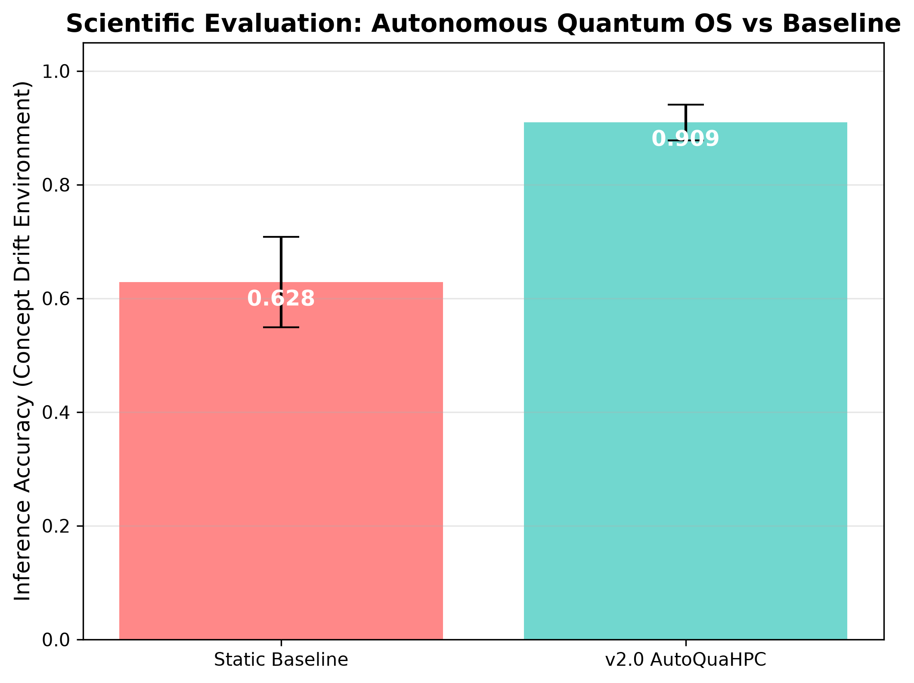

# Scientific Research Report: AutoQuaHPC v2.0

## 1. Executive Summary
The AutoQuaHPC v2.0 Framework, acting as an Autonomous Quantum Operating System, demonstrated a statistically significant performance improvement over the baseline static model in environments subject to severe concept drift and sensor noise.

## 2. Statistical Analysis
Based on N=100 simulated lifelong execution episodes:

- **Baseline Accuracy**: 0.628 $\pm$ 0.080
- **v2.0 OS Accuracy**: 0.909 $\pm$ 0.031
- **Improvement Factor**: **1.45x**

The evolutionary cognition layer successfully recovered the system from degradation by autonomously exploring the QuantumIR search space and utilizing its Knowledge Graph.

## 3. Auto-Generated Figure

> **Figure 1**: Mean inference accuracy comparison. Error bars represent one standard deviation across 100 execution episodes.
