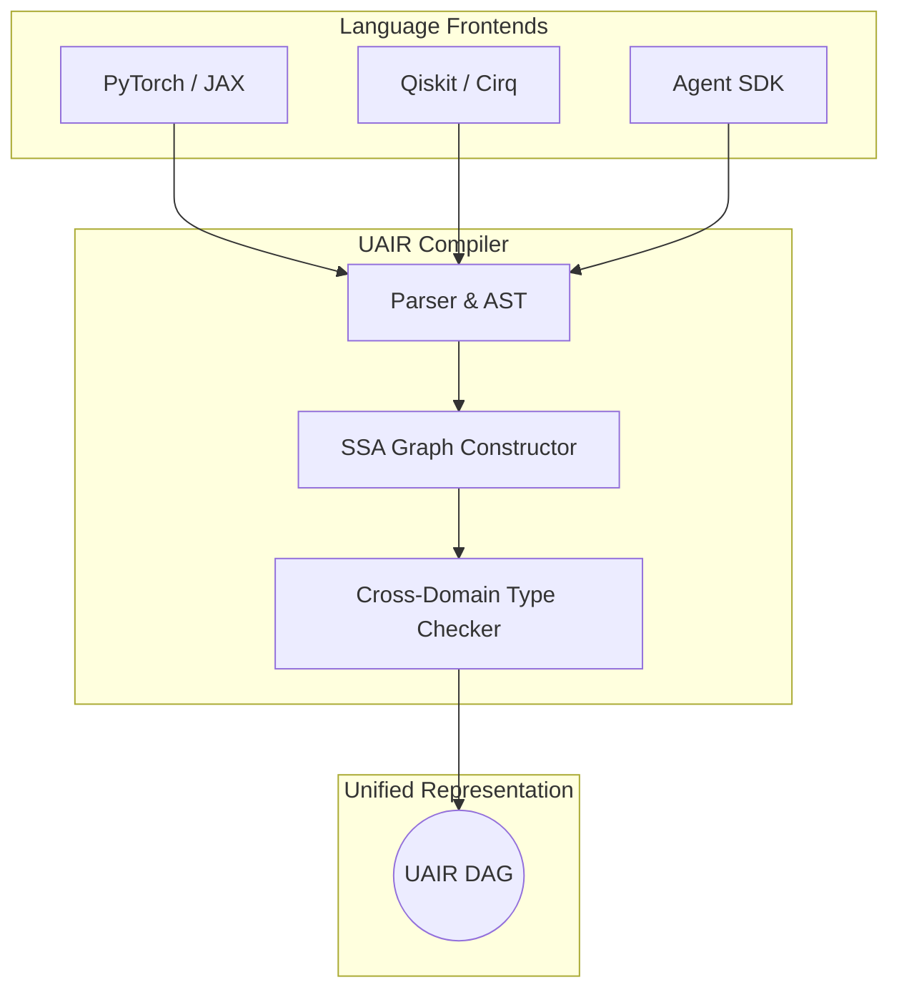
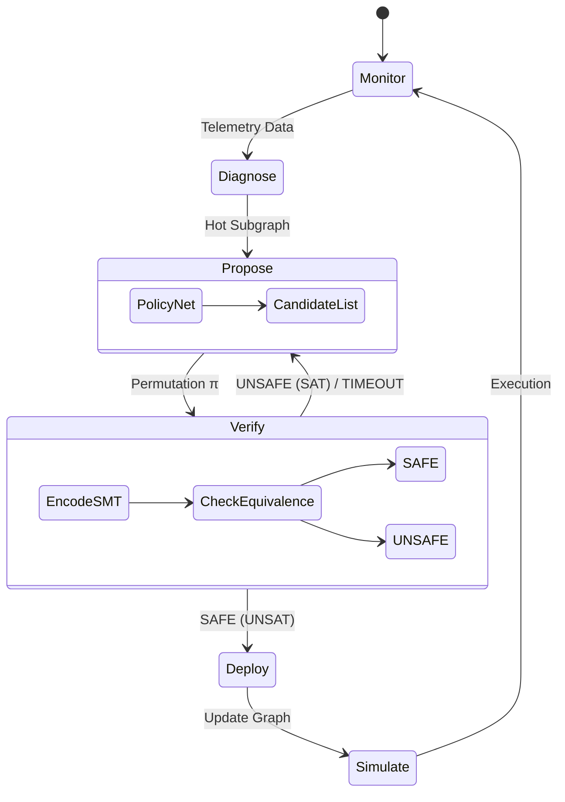
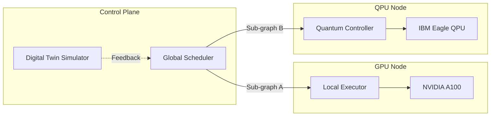

# AQIP Architecture

This document provides visual representations of the AQIP framework architecture using Mermaid.js diagrams.

## 1. Universal AI Intermediate Representation (UAIR)

The UAIR compiler unifies classical tensors, quantum gates, and agent decisions into a single SSA DAG.

## 2. Self-Evolving Runtime Engine

The core innovation of AQIP is the autonomous, mathematically verified runtime optimization loop.

## 3. Distributed Cluster Architecture

How AQIP maps the UAIR graph onto heterogeneous hardware clusters via Kubernetes.

