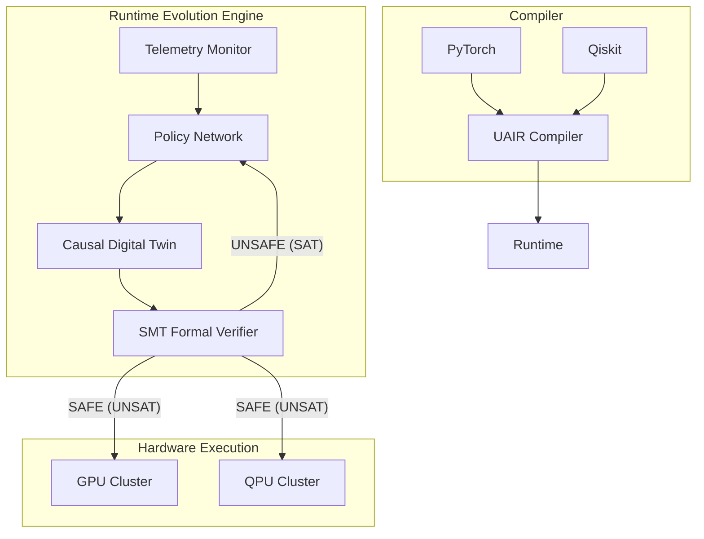

# Chapter 4: Architecture of the AQIP Ecosystem

## 4.1 Architectural Paradigms vs State of the Art

To establish the superiority of the AQIP architecture, we systematically deconstruct the design choices of existing frameworks.

### 4.1.1 vs. Qiskit / OpenQASM
**The Qiskit Flaw:** Qiskit compiles quantum circuits statically. If the physical QPU heats up and the $T_1$ coherence time of Qubit 4 degrades, the pre-compiled circuit will fail.
**The AQIP Solution:** The *Meta-Evolutionary Engine* continuously monitors the QPU. When Qubit 4 degrades, AQIP autonomously proposes a UAIR DAG permutation to route around Qubit 4, verifies it via SMT, and hot-swaps it into the live execution stream.

### 4.1.2 vs. PennyLane
**The PennyLane Flaw:** PennyLane enables hybrid Quantum-Classical machine learning via autograd tapes. However, it executes these domains sequentially: PyTorch computes, halts, serializes to numpy, sends to the QPU simulator, halts, deserializes, and computes the backward pass.
**The AQIP Solution:** Because UAIR is a single SSA DAG natively containing both $V_{tensor}$ and $V_{quantum}$, AQIP fuses classical parameter preparation operations directly into the quantum execution stream, eliminating serialization entirely.

### 4.1.3 vs. Ray
**The Ray Flaw:** Ray is a generic task-graph scheduler. It treats quantum subroutines as black-box tasks, completely blind to the internal gate structure.
**The AQIP Solution:** AQIP is a *white-box compiler-scheduler*. It understands the semantic meaning of both matrix multiplications and quantum CNOT gates, allowing it to mathematically verify structural safety before dispatch.

## 4.2 The Zero-Trust Autonomous Runtime

The fundamental architecture of AQIP mandates that **no autonomous permutation can reach the physical hardware without passing an SMT formal equivalence check**. This elevates autonomous compilation from an academic curiosity to an enterprise-grade production tool.
